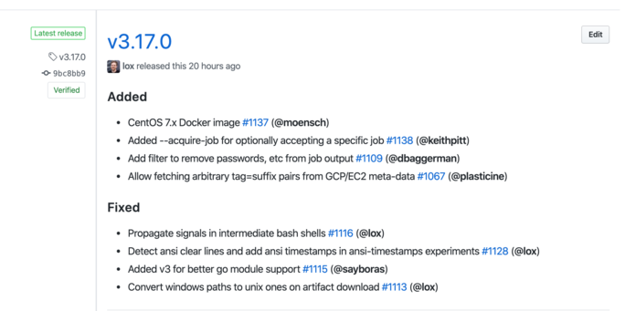
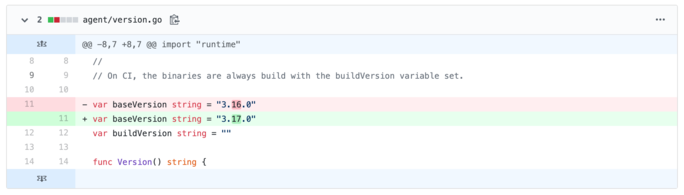

# Agent Release Process

Creating a release for the Buildkite agent is made up of the following steps:

1. Generate a list of changes
1. Create a release branch
1. Edit the changelog file
1. Update the agent version file
1. Commit your changes
1. Create draft release in GitHub
1. Merge pull request
1. Release in Buildkite
1. Update the docs
1. Update the GitHub release
1. Update the Elastic CI Stack agent version
1. Announcements

Instructions for each can be found below 🌈 If you find something that is out of date, please update it 🙇🏻‍♀️

## Generate a list of changes

We use [ghch](https://github.com/buildkite/ghch) to generate the changelogs.

To preview the changes run:

```
~/go/bin/ghch --format=markdown --from=v3.xx.yy --next-version=v3.xx.yy+1
```

This will print a list of all the changes that are ready to go out. Looking at
the list, you need to decide if it’s a minor or bugfix release. You can re-run
the `ghch` command with a different version number if you decide to change it
before releasing. 

Copy the list of changes to add to the changelog file.

## Create a release branch

Using git, create a release branch:

```
git checkout -b $USER/release/3.xx.yy+1 origin/main
```

## Edit the changelog file

Open the [`CHANGELOG.md`](CHANGELOG.md) file with your favourite editor and paste in the list
from the `ghch` output. This will likely need some cleaning up and editing as it
only lists the names of the PRs.

Try to make each line short but descriptive - we want people to be able to
understand the general gist of the change without having to read paragraphs or
go into the PR itself. 

The changelog gets split up into three sections: Added, Changed, and Fixed.

For example, this was the changelog for the v3.17.0 release:



## Update the agent version file

Open the [agent/version.go](agent/version.go) file with your favourite editor
and update the `baseVersion` variable to the new version number:



## Commit your changes

Provide a descriptive message along with your commit:

```
git commit -a -m "Bump version and CHANGELOG for v3.17.0"
```

Publish your branch and create a pull request for your branch. Allow the
Buildkite Pipeline to run, once it has passed merge your change to the default
branch.

## Release in Buildkite

**NOTE**: don't push a new git tag for the release. Unlike the Elastic CI Stack
for AWS, the release steps will tag the release for you.

An Agent build will automatically trigger from your push to master. Wait for
this to run and upload the release steps. Unblock each of the three release
steps (Edge, Beta, and Stable) at the end.

## Update the docs

- Update to the latest agent
- Check out docs repo.
- In the docs repo, run `./scripts/update-agent-help.sh`
- Check the docs diff, and make a pull request.

## Update the GitHub release

The release pipelines create the GitHub release and upload the binaries to it
(internally it uses GitHub Release). After the stable build has finished, and
the GitHub release automatically created, edit the release description pasting
the relevant markdown from the changelog:

https://github.com/buildkite/agent/releases

## Update the Elastic CI Stack agent version

Update the `master` branch of the Elastic CI Stack for AWS with the latest agent
release.

Create a branch and run `make bump-agent-version`, commit the changes, publish
your branch and create a pull request. Once the tests have passed merge your
pull request.

Once merged, a new AMI will be built with the latest agent and copied to all the
supported regions. Customers can update their template to the latest `master`
version or wait for a tagged release.

## Announcements

Draft a Buildkite Changelog using the following template:

> Title: Agent vx.x.x and AWS Elastic Stack vx.x.x release
> Content:
> The x.x.x version of the buildkite-agent and the x.x.x version of the AWS elastic stack are now available.
> 
> The agent has added the ability to do ____, and ____. This agent release has been added to the x.x.x release of the elastic stack, as well as ____ and ____. 
> 
> For full list of additions, changes, and fixes, see the [buildkite-agent changelog](https://github.com/buildkite/agent/releases/tag/v3.31.0) and the [elastic-ci-stack-for-aws changelog](https://github.com/buildkite/elastic-ci-stack-for-aws/releases/tag/v5.4.0) on GitHub.

Publish a 🚀 Release category message in the [🤖 Agent Message Board](https://3.basecamp.com/3453178/buckets/11763568/message_boards/1730831248).
