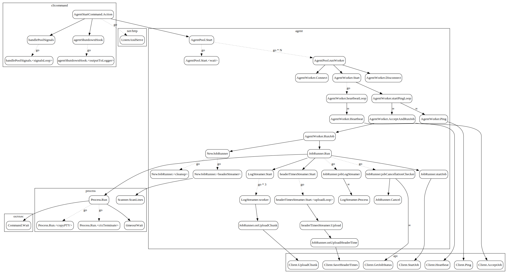

# Agent start

`buildkite-agent` does a lot of things, and so it ends up running a lot of 
different goroutines. This is an attempt to document what is going on at the goroutine level.

The diagram below depicts the (incomplete) call graph that runs when running
`buildkite-agent start`. Packages are shown as surrounding rectangles.
Solid arrows denote regular function calls. Dotted arrows (labelled "go") are
goroutine calls. Some anonymous funcs are given names for the purpose of the
diagram (in angle brackets).

`buildkite-agent start` effectively begins at the `Action` in `AgentStartCommand`. 
Already there are four different goroutines running: one for handling signals,
one that waits to run the shutdown hook, one for the inbuilt HTTP server, and
finally the main goroutine continues to start the `AgentPool`.

`AgentPool` manages `AgentWorker`s - the number of workers is given by the
concurrency config option or flag. `AgentPool` also spins up one other 
goroutine which waits for all the workers to finish, then closes a channel.
The effect is that `AgentPool` returns either `nil` once all workers have 
stopped without error, or the first non-nil error.

After connecting, `AgentWorker` runs two main goroutines: one periodically 
calls `Heartbeat`, the other more frequently calls `Ping`. `Ping` is how the 
worker discovers work from the API.

Once a job has been accepted, the `AgentWorker` fires up a `JobRunner` to run
it. Each `JobRunner` starts several goroutines that handle various tasks:

* Processing chunks of log output from the job
* Streaming chunks of logs up to the API
* Streaming header times up to the API
* Periodically checking with the API if the job is cancelled
* Waiting for the job to be over to mark the job as completed

The core of the job runner is running a `Process`, which itself spins up a few
helper goroutines:

* Copying PTY output
* Waiting on context cancellation in order to hard-terminate the process

